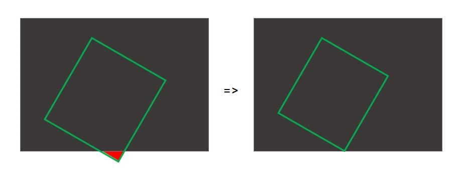

# Python Image Processing 

## Description
Your task consists of writing two Python scripts which will do video capture, transmission and processing. 

For that, you will need to have Python 3 and openCV installed. 
```bash 
pip install opencv-python
```
You can use any other libraries you need or think they're useful.

## 1. **video_acquisition.py**
This script should open a webcam using openCV, read individual frames and transmit them to the next script in an efficient manner. Select a transmission mechanism/protocol that could work for image transmission over the network. There are no bandwith constraints. 

## 2. **video_crop.py**
This script should be able to receive the realtime images from the previous script and apply a rotated crop transform. Your task is to develop this rotated crop transform module and display the resulting video. 

You are provided with a JSON file containing the information on how to crop a rotated rectangle from an image, specified through the following properties: 
```json
{
    alpha: 314,                 // angle in degrees,
    ox: 0.5012165635302855,     // crop center x coordinate, relative to image width 
    oy: 0.5129818609975263,     // crop center y coordinate, relative to image height
    width: 0.256313847799229,   // width, relative to image width
    height: 0.6563988412619505  // height, relative to image height
}
```

To try out different settings for cropping and validate that the method is working correctly, check out the included **cropconfig.htm** file. It will allow you to generate different settings for this crop rectangle. If the cropping rectangle is ill specified you will have to treat the following edge case properly:



**Note**: Most webcams are 4:3 in aspect size, and the image within the cropconfig tool is fixed to this aspect ratio as well.

### Methodology
Since you should be processing realtime images in a continuous manner, the most important thing for your script to do is to work reliably without crashing. We will be also evaluating the performance of your cropping solution.
